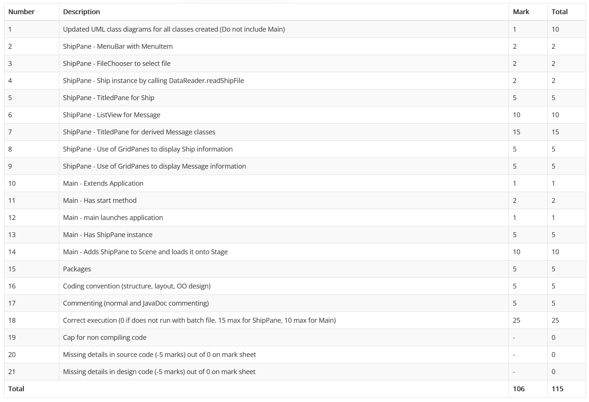
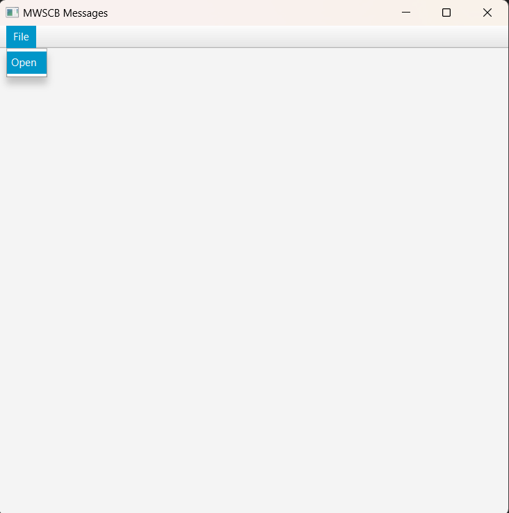
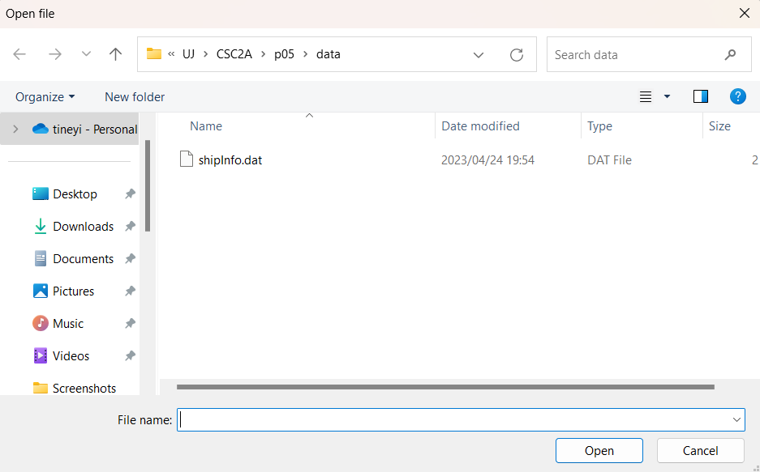

# UJ CSC2A Practical 5

## Table Of Content

## Marks



## Additional Information

This practical was an extension of [Practical 4](https://github.com/ThaBeanBoy/UJ_CSC2A_P04). 
This time, we were provided a [JAR file](./lib/p05.jar) that contains classes needed for this
practical. This practical was more focused on learning JavaFX.

## Using JavaFX

For school, we are using a .bat file to compile & run our java programs. Here's a little peek
inside it.

```bat
set USE_JAVAFX=true
set JAVAFX_HOME="path\to\JavaFX\javafx-17"
set JAVAFX_MODULES=javafx.base,javafx.controls,javafx.fxml,javafx.graphics,javafx.media
set JAVAFX_ARGS=
if %USE_JAVAFX%==true (set JAVAFX_ARGS=--module-path %JAVAFX_HOME%\lib --add-modules=%JAVAFX_MODULES%)
echo %USE_JAVAFX%, %JAVAFX_ARGS%
```
Inside the bat file, we set `USE_JAVAFX` to true, this way, when we compile, the bat file knows that we'er using JavaFX.
You have to set `JAVAFX_HOME` to the correct file path where you saved JavaFX. `JAVAFX_MODULES` are the JavaFX modules
that we are going to use. If `USE_JAVAFX` is set to true, `JAVAFX_ARGS` will be set to 
`--module-path %JAVAFX_HOME%\lib --add-modules=%JAVAFX_MODULES%`. **Remember, we already discussed `JAVAFX_HOME` &`JAVAFX_MODULES`**

### Compiling

The following line is the line that compiles our source code into class files.

```bat
javac %JAVAFX_ARGS% -sourcepath %PRAC_SRC% -cp %PRAC_BIN%;%PRAC_LIB% -d %PRAC_BIN% %PRAC_SRC%\Main.java
```

The thing I want to focus on is the `%JAVAFX_ARGS%`. Remember, if `USE_JAVAFX` is set to true, `JAVAFX_ARGS` is basically
`--module-path %JAVAFX_HOME%\lib --add-modules=%JAVAFX_MODULES%`. In order for a JavaFX application to compile, you need
to provide the JavaFX library path & the modules.

You could also set up your IDE to run javafx applications too.

### Running JavaFX application

This is the command that runs a JavaFX application.

```bat
java %JAVAFX_ARGS% -cp %PRAC_BIN%;%PRAC_LIB% Main
```

## Making the JavaFX Application

### JavaFX Basics

These [docs](https://fxdocs.github.io/docs/html5/) helped towards my understanding of JavaFX.


This example that **was on the docs** really helped too.
```java
public class HelloApp extends Application {
    private Parent createContent() {
        return new StackPane(new Text("Hello World"));
    }

    @Override
    public void start(Stage stage) throws Exception {
        stage.setScene(new Scene(createContent(), 300, 300));
        stage.show();
    }

    public static void main(String[] args) {
        launch(args);
    }
}
```

### Ship Pane

For this practical, we were supposed to make a `ShipPane`, this is a custom layout node that 
inherits from the `stackPane` class. 

#### Menu Bar

Implementation of this can be found in this [file](./src/acsse/csc2a/gui/ShipPane.java).

This node is supposed to contain a menu bar. Inside the menu bar, The user is supposed to 
interact with the menu bar to open a file picker.

```java
// imports ...

public class ShipPane{
    private final MenuBar menuBar;
    
    public ShipPane(){
        final Menu FileMenu = new Menu("File");
        final MenuItem OpenFileMenuItem = new MenuItem("Open");

        // Adding file menu to the menu bar
        menuBar = new MenuBar(FileMenu);

        // Adding the open menu item to the file menu
        FileMenu.getItems().add(OpenFileMenuItem);
        
        // File Picker Event Listener

        //Displaying the ShipPane
        VBox Box = new VBox();
        Box.getChildren().addAll(menuBar);
        this.getChildren().add(Box);
        this.setWidth(400);
    }
    
    // rest of ShipPane class
}
```



#### File Picker

Implementation of this can be found in this [file](./src/acsse/csc2a/gui/ShipPane.java).

```java
public class ShipPane{
    private final MenuBar menuBar;
    
    public ShipPane(){
        // Making menu bar
        
        // File Picker Event Listener
        final MenuItem OpenFileMenuItem = new MenuItem("Open");

        OpenFileMenuItem.setOnAction(e->{
            final FileChooser fileChooser = new FileChooser();

            // Setting file chooser window
            fileChooser.setTitle("Open file");
            fileChooser.setInitialDirectory(new File("data"));

            // Open file picker window
            File shipFile = fileChooser.showOpenDialog(null);

            if(shipFile != null){
                // reading the file
                this.ship  = DataReader.readShipFile(shipFile);

                //Display the ships
                this.displayMessages();
            }
        });
        
        // Displaying the ShipPane
    }
    
    // rest of ShipPane class
}
```
When the user clicks the `OpenFileMenuItem`, the even listener will be fired. Here, I used
a lambda function. this way is easier for me due to my prior experience with javascript 
function (especially arrow functions).

A `FileChooser` object first has to be made. then we can set different attributes such as 
the `title`, `initial directory` & so on.

The `showOpenDialog` method from the `FileChooser` class is the one that opens the file picker.
Once the user picks the file they want, it returns that file as a `File` object.



#### ReadOnly TextField
